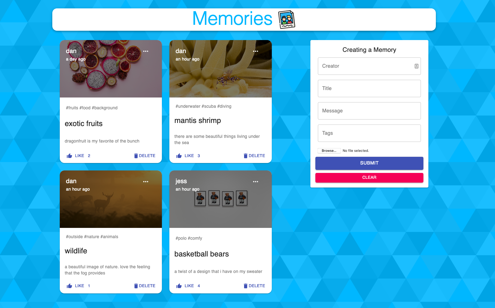

# mern-memories

Full Stack MERN application that allows users to create, edit, and delete memories; practice projet via JavaScript Mastery on YouTube

Server Copy folder is added as copy of server code which is not in this repository

# Deployed at...

https://mern-memories-dir.netlify.app/

